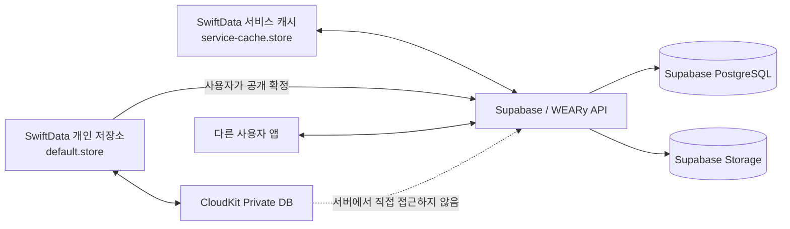
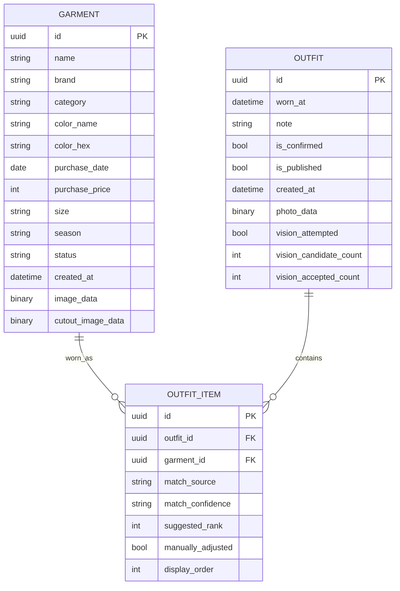
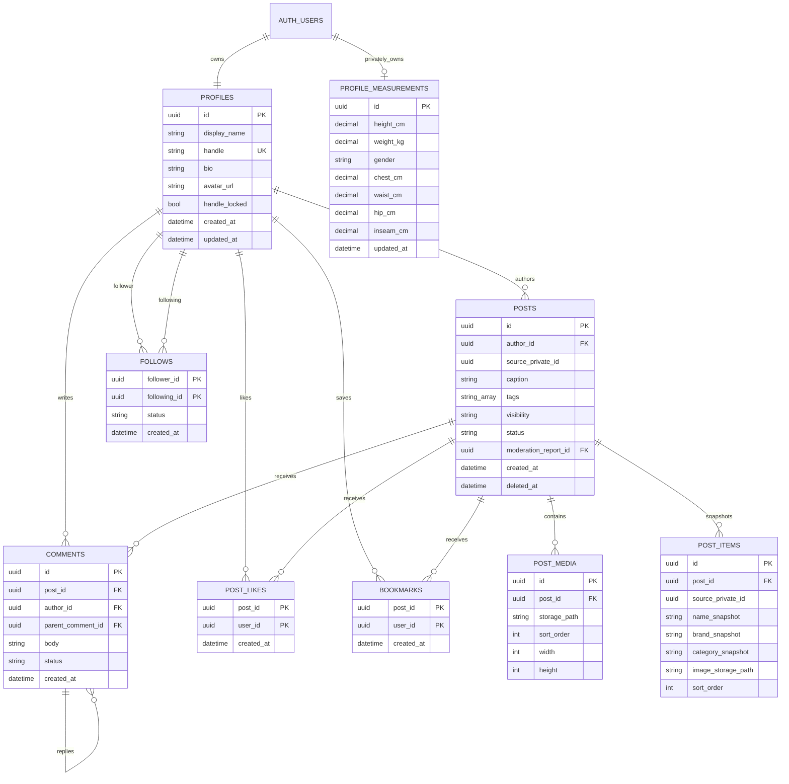
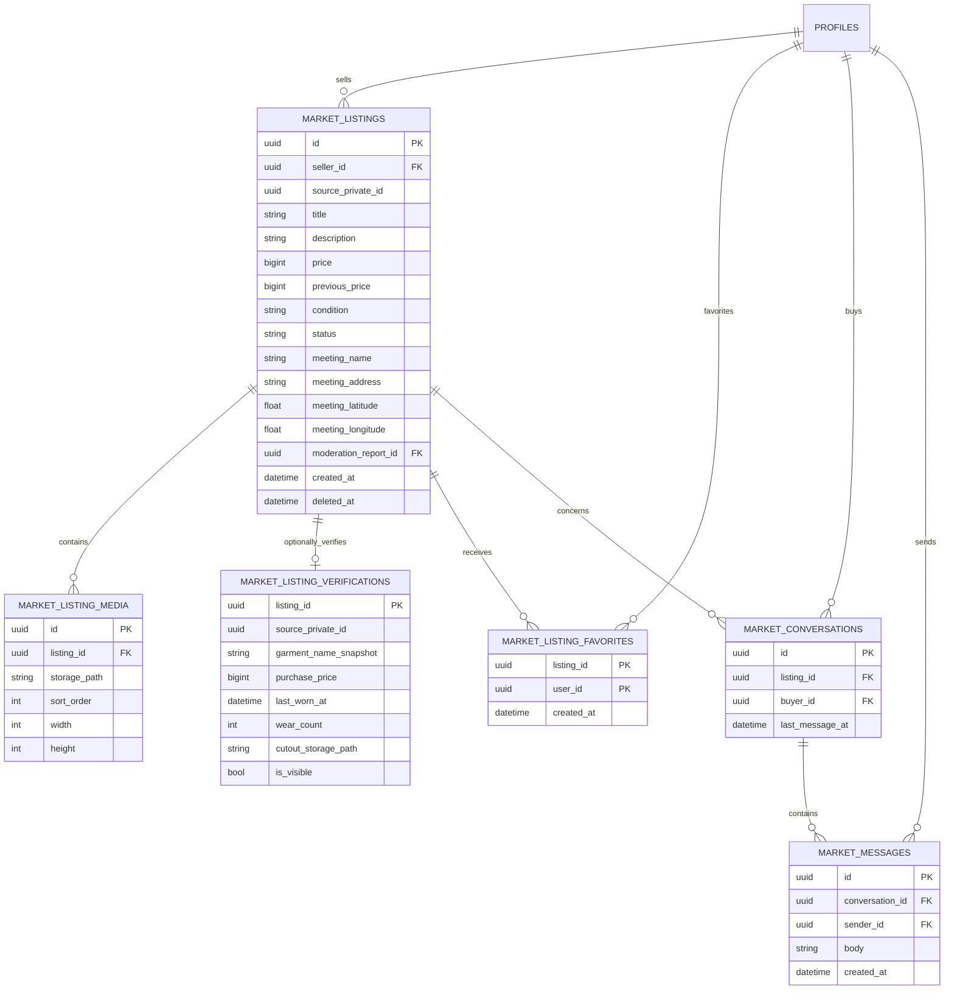
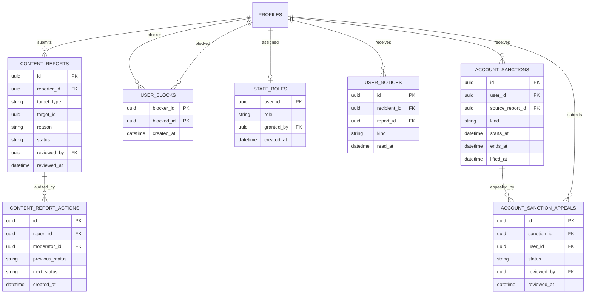
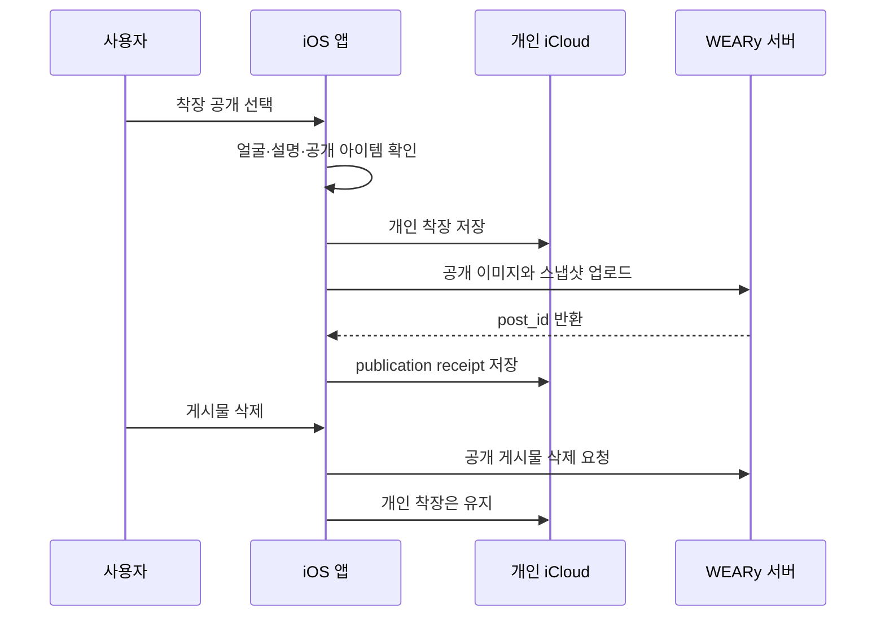

# WEARy 데이터 아키텍처 및 ERD v1

## 1. 설계 목표

WEARy의 데이터는 소유권과 공개 범위에 따라 두 영역으로 분리한다.

| 영역 | 저장 위치 | 데이터 소유권 | 예시 |
| --- | --- | --- | --- |
| 개인 영역 | SwiftData + 사용자의 CloudKit private database | 사용자 | 옷, 구매 가격, 비공개 착장, 착용 통계 |
| 서비스 영역 | Supabase + 필요 시 WEARy API | 서비스가 사용자 동의 범위에서 처리 | 공개 게시물, 댓글, 팔로우, 판매 상품, 채팅 |

핵심 원칙은 다음과 같다.

- 서버는 사용자의 개인 CloudKit 데이터베이스를 직접 조회하지 않는다.
- 개인 착장은 기본적으로 비공개다.
- 공개 또는 판매를 확정할 때 앱이 필요한 필드만 서비스 서버로 복사한다.
- 공개 데이터는 원본을 참조하는 포인터가 아니라 당시 정보의 스냅샷이다.
- 게시물이나 판매 글을 삭제해도 개인 옷장과 착장 기록은 유지된다.
- 개인 옷을 삭제해도 이미 공개된 데이터는 별도 삭제 요청 전까지 독립적으로 유지될 수 있음을 게시 전에 안내한다.

## 2. 전체 데이터 흐름

앱 삭제 후 재설치 시 같은 Apple 계정으로 iCloud에 로그인되어 있고 앱의 iCloud 사용이 허용되어 있다면, 개인 영역을 CloudKit에서 다시 동기화하는 경험을 목표로 한다. 동기화가 끝나기 전에는 빈 옷장으로 단정하지 않고 진행 상태를 표시해야 한다.

### 2.1 현재 로컬 저장소 경계

- 기존 앱의 `default.store`는 `Garment`, `Outfit`, `OutfitItem` 전용 개인 저장소로 그대로 승계해 업데이트 시 개인 기록을 유지한다.
- `CommunityPost`, `MarketListing`은 별도 `service-cache.store`에 저장한다. 이 저장소는 Supabase 또는 데모 데이터에서 다시 만들 수 있으므로 CloudKit 동기화 대상이 아니다.
- 개인 모델은 CloudKit에서 지원하지 않는 unique 제약을 제거하고 UUID를 애플리케이션 식별자로 유지한다. 필수 속성에는 기본값을 두고 모든 관계에는 역관계와 0개 허용 조건을 둔다.
- 일반 `Debug`·`Release`는 개인 저장소도 로컬 전용이다. `CloudKitDebug`만 `iCloud.com.weary.prototype` private database를 요청하므로 미등록 컨테이너가 기존 개발 실행을 방해하지 않는다.

## 2.2 기술 결정 — Supabase 우선

2026-09-08 기준 공용 커뮤니티·마켓 백엔드는 Supabase를 1차 기술로 채택한다.

| 역할 | 선택 기술 |
| --- | --- |
| 커뮤니티 계정 | Supabase Auth 이메일 로그인 + OAuth 확장 |
| 관계형 데이터 | Supabase PostgreSQL |
| 공개 착장·상품 이미지 | Supabase Storage |
| 초기 댓글·채팅 갱신 | Supabase Realtime |
| 민감한 상태 변경 | PostgreSQL function 또는 Supabase Edge Functions |
| 장기 확장 | 동일 PostgreSQL 앞에 WEARy 전용 API 추가 |

선택 이유는 WEARy의 좋아요, 팔로우, 댓글, 상품, 대화 참여자 구조가 관계형 모델에 잘 맞고, 초기 개발 속도를 확보하면서도 PostgreSQL 스키마를 장기 자산으로 유지할 수 있기 때문이다.

다음 원칙을 적용한다.

- iOS 앱에 `service_role` 키를 포함하지 않는다.
- 앱이 직접 접근하는 모든 공개 테이블과 Storage bucket에 RLS 정책을 적용한다.
- 피드 조회와 본인 게시물 CRUD는 SDK로 시작하되, 예약·판매 완료·신고 제재처럼 권한이 중요한 작업은 서버 함수로 처리한다.
- 클라이언트가 보내는 좋아요 수, 작성자 ID와 판매 상태를 신뢰하지 않고 서버에서 검증한다.
- 첫 서버 범위는 커뮤니티로 제한하고, 안정화 후 마켓과 채팅을 연결한다.

### 2.3 현재 피드 동기화 상태

- 앱 시작과 Pull-to-Refresh에서 `CommunityFeedRepository`가 공개 범위상 조회 가능한 최신 게시물을 15개씩 읽는다.
- 게시물과 작성자 프로필, 아이템 스냅샷, 댓글, 좋아요, 북마크, 팔로우 상태를 한 번의 관계형 조회 결과로 구성한다.
- private `community-media` 이미지는 RLS가 허용한 객체만 내려받아 SwiftData 원격 캐시에 저장한다.
- 서버 조회가 성공하면 원격 캐시 구간을 받은 목록으로 교체해 삭제되거나 더 이상 보이지 않는 게시물을 제거한다.
- 서버 조회가 실패하면 캐시를 변경하지 않으며 로컬 샘플과 사용자가 작성한 게시물을 계속 표시한다.
- 피드 작성 또는 착장 기록의 공개 선택 시 게시물을 먼저 비공개 초안으로 만들고 착장 사진과 아이템 스냅샷을 업로드한다.
- 모든 메타데이터 저장이 끝난 뒤에만 게시물을 공개로 전환하며, 중간 실패 시 업로드 파일과 초안 게시물을 보상 삭제한다.
- 서버 게시에 실패해도 먼저 저장한 개인 착장 기록은 유지하고 피드 작성 화면에서 재시도할 수 있다.
- 원격 게시물의 좋아요·북마크·팔로우는 복합 기본 키 기반 upsert/delete로 멱등하게 저장하고, 댓글은 인증 사용자 ID를 서버 정책으로 검증해 추가한다.
- 화면에서는 소셜 상태를 먼저 반영한 뒤 요청 실패 시 이전 상태로 되돌린다. 발표용 로컬 샘플 게시물은 네트워크 없이 기존 SwiftData 동작을 유지한다.
- MY의 팔로워·팔로잉 목록은 `follows`와 `profiles` 관계를 서버에서 조회하며, 서버 연결 실패 시 발표용 로컬 목록을 유지한다.
- 생성 시각과 UUID의 복합 커서로 다음 페이지를 중복 없이 병합한다.
- 게시물, 미디어, 아이템, 댓글, 좋아요, 북마크와 팔로우의 Realtime 변경을 감지하면 현재까지 읽은 원격 구간을 다시 동기화한다.

### 2.4 현재 마켓 서버 기반 상태

- `market_listings`는 판매자, 가격과 직전 가격, 상품 스냅샷, 거래 상태와 지도 위치를 저장한다.
- 가격이 바뀌면 PostgreSQL 트리거가 클라이언트 입력을 신뢰하지 않고 기존 가격을 `previous_price`에 기록한다.
- `market_listing_media`는 매물당 최대 8장의 이미지 경로와 순서를 저장한다.
- `market_listing_verifications`는 구매가·착용 횟수 등 개인 옷장 스냅샷을 매물 본문과 분리한다. 판매자가 공개한 행 또는 본인 행만 조회할 수 있다.
- `market_listing_favorites`는 사용자 본인만 읽고 변경할 수 있다.
- 모든 마켓 테이블은 RLS와 Realtime publication이 적용됐다.
- private `market-media` 버킷은 10MB 이하 이미지 파일만 허용하며 `사용자ID/매물ID/파일명` 경로의 매물 소유자를 확인한다.
- 다른 사용자는 공개 상태 매물에 메타데이터로 연결된 갤러리와 판매자가 공개한 인증 누끼만 새로 내려받을 수 있다. 이미 공개되어 사용자의 기기나 네트워크 캐시에 저장된 사본까지 회수할 수는 없음을 공개 화면에서 고려한다.
- `MarketListingRepository`가 판매자 프로필, 장소, 직전 가격, 관심 상태, 공개 인증과 private 이미지를 함께 읽고 원격 매물만 SwiftData 캐시에 교체한다.
- 마켓 화면은 최신 원격 매물 최대 30개와 발표용 로컬 샘플을 함께 표시하며, 서버 조회 실패 시 마지막 캐시를 유지한다.
- `SupabaseMarketListingMutationRepository`가 매물 작성·수정·거래 상태 변경·삭제와 최대 8장 이미지 업로드를 처리한다.
- 작성은 숨김 초안을 먼저 만들고 업로드 완료 후 `replace_market_listing` RPC에서 매물·사진 순서·선택적 인증을 한 트랜잭션으로 공개한다. 실패한 초안과 파일은 보상 삭제한다.
- 원격 매물의 관심 등록·해제는 복합 기본 키 기반 upsert/delete로 멱등하게 저장하며, 요청 실패 시 optimistic 화면 상태를 되돌린다.
- 매물, 미디어, 인증, 관심과 판매자 프로필의 Realtime 변경을 감지하면 원격 마켓 캐시를 다시 동기화한다.
- `market_conversations`는 매물과 구매자 조합을 유일하게 유지하고 판매자는 자기 매물의 대화만, 구매자는 자신의 대화만 조회한다.
- `market_messages`는 해당 대화의 구매자와 매물 판매자만 읽고 작성할 수 있으며 메시지가 추가되면 대화의 최근 활동 시각을 갱신한다.
- 채팅 목록과 열린 대화는 Realtime 이벤트를 받아 다시 동기화한다. 발표용 로컬 샘플은 기존 SwiftData Mock 대화를 유지한다.
- `content_reports`는 신고자와 대상 조합을 유일하게 저장하고 신고자 본인만 조회·삭제할 수 있다. 신고만으로 콘텐츠를 자동 제재하지 않는다.
- `user_blocks`는 본인의 차단 목록만 읽고 변경할 수 있으며, Repository가 차단한 작성자의 원격 피드·매물·소셜 관계를 개인 화면에서 제외한다.

## 3. 개인 iCloud 영역 ERD

아래 ERD는 현재 `Garment`, `Outfit`, `OutfitItem` SwiftData 모델을 기준으로 한다. 일반 Debug·Release에서는 로컬에 저장하며, CloudKit capability를 연결한 구성에서는 같은 모델을 사용자의 private database와 동기화하는 것을 목표로 한다. 통계 값은 중복 저장하지 않고 확정된 `OUTFIT_ITEM`을 기준으로 계산한다.

### 개인 모델 규칙

- 옷 원본과 누끼 이미지는 현재 `Garment.imageData`, `Garment.cutoutImageData`의 external storage 필드로 분리한다.
- 실제 착장 사진은 `Outfit.photoData`의 external storage 필드에 저장한다.
- 한 착장에는 같은 옷을 한 번만 연결한다. 앱 로직으로 `(outfit_id, garment_id)` 중복을 막는다.
- `wear_count`, `last_worn_at`, `cost_per_wear`는 `OUTFIT_ITEM`과 `OUTFIT`에서 계산한다.
- `is_published`는 화면 상태를 위한 로컬 표시값이며 서버 게시물의 진실 원천은 아니다. 서버 게시 결과를 장기 추적하려면 `PUBLICATION_RECEIPT` 같은 로컬 영수증 모델을 별도로 추가한다.
- CloudKit 동기화 모델에서는 `@Attribute(.unique)` 없이 UUID를 애플리케이션 수준 식별자로 사용한다. 실제 컨테이너 연결 후 다기기 병합에서 논리 UUID 중복이 생기지 않는지 추가 검증한다.
- 대용량 원본의 업로드 비용, iCloud 용량, 셀룰러 정책은 실제 CloudKit 연결 후 별도로 검증한다.

### 공개·판매 연결 영수증

개인 영역에는 서버 객체 전체를 복제하지 않고 다음 최소 정보만 저장하는 방식을 권장한다.

| 필드 | 의미 |
| --- | --- |
| `id` | 로컬 영수증 UUID |
| `source_type` | `outfit` 또는 `garment` |
| `source_id` | 개인 영역 객체 UUID |
| `destination_type` | `post` 또는 `listing` |
| `server_id` | 서버가 발급한 공개 객체 ID |
| `published_at` | 업로드 완료 시각 |
| `last_sync_status` | 업로드·수정·삭제 동기화 상태 |

## 4. 서비스 서버 ERD

아래 ERD는 현재 Supabase migration에 실제로 생성된 테이블을 도메인별로 나눈 것이다. `auth.users`는 Supabase Auth가 관리하며, 앱이 직접 다루는 공개 프로필과 민감한 신체 치수는 별도 테이블로 분리한다.

### 4.1 계정과 커뮤니티

### 4.2 중고거래와 채팅

### 4.3 신고·차단·제재 운영

`content_reports.target_type + target_id`는 게시물·매물·메시지·사용자를 가리키는 다형성 논리 참조이며 물리 외래 키는 아니다. `account_auth_rate_limits`는 인증 Edge Function의 남용 방지용 운영 테이블이므로 도메인 ERD에서는 제외한다.

### 서버 모델 규칙

- 인증 주체는 Supabase `auth.users`이며 이메일 로그인과 추후 OAuth 공급자가 같은 사용자 ID를 공유한다. iCloud 상태와 서비스 로그인 상태는 서로 독립적이다.
- `profile_measurements`는 본인만 읽고 수정할 수 있으며 공개 `profiles`와 분리한다.
- `source_private_id`는 재게시·수정 상태를 찾기 위한 불투명 UUID다. 서버는 이 값으로 기기나 CloudKit의 원본을 조회할 수 없다.
- `post_items`, `market_listings`, `market_listing_verifications`는 게시 시점의 개인 옷 데이터 스냅샷을 저장한다.
- 좋아요, 북마크, 팔로우와 관심은 복합 기본 키 조인 테이블을 진실 원천으로 삼는다.
- 메시지는 현재 텍스트 행으로 보존하며 별도의 구매 요청 테이블은 두지 않는다. 구매자와 판매자는 채팅으로 합의하고 판매자가 매물 상태를 `active → reserved → sold`로 변경한다.
- 게시물·댓글·매물은 상태와 soft delete를 사용하고, 신고·차단·제재는 별도 운영 테이블과 RPC로 권한을 집행한다.
- 가격은 부동소수점이 아닌 원 단위 정수로 저장하며 변경 전 가격은 데이터베이스 트리거가 기록한다.
- 계정 탈퇴는 소유한 Storage 객체를 먼저 삭제한 뒤 현재 인증 사용자만 삭제하는 RPC를 호출하고, 외래 키 cascade와 기기 데이터 정리를 완료하는 순서로 처리한다.

## 5. 개인 데이터가 공개되는 과정

업로드가 실패하면 개인 착장 저장은 성공 상태로 유지하고, 공개 영수증만 `failed` 또는 `pending`으로 둔다. 네트워크 복구 후 사용자가 재시도할 수 있어야 하며 중복 게시를 막기 위해 idempotency key를 사용한다.

## 6. 동기화 및 충돌 정책 초안

| 상황 | 정책 |
| --- | --- |
| 두 기기에서 같은 옷 정보 수정 | 필드 단위 병합이 어렵다면 최신 `updated_at` 우선, 충돌 로그 보존 |
| 한 기기에서 옷 삭제, 다른 기기에서 착장 추가 | 삭제를 즉시 물리 삭제하지 않고 `deleted_at`으로 전파 후 사용자 확인 |
| 공개 업로드 중 앱 종료 | 로컬 영수증 `pending`을 재시도 |
| 게시 요청 재전송 | 동일 idempotency key에는 같은 서버 객체 반환 |
| iCloud 로그아웃 | 로컬 접근 정책과 로그아웃 안내를 별도 정의하고 공개 서버 계정은 자동 로그아웃하지 않음 |
| 서버 게시물 삭제 | 개인 착장에는 영향 없음 |
| 개인 옷 삭제 | 서버 스냅샷에는 자동 영향 없음; 연결된 공개 항목 삭제 선택 제공 |

## 7. 이미지 저장 원칙

| 이미지 | 개인 iCloud | 서비스 스토리지 |
| --- | --- | --- |
| 옷 원본 | 저장 | 판매자가 선택한 경우에만 공개용 사본 |
| 옷 누끼 썸네일 | 저장 | 게시물·상품에 필요할 때 최적화 사본 |
| 전신 착장 원본 | 저장 | 저장하지 않음 |
| 커뮤니티 공개 이미지 | 선택 전 편집본을 개인 영역에 둘 수 있음 | 리사이즈·메타데이터 제거 후 저장 |
| 채팅 이미지 | 저장하지 않음 | 보존 정책이 적용된 서버 객체 |

공개 업로드 전 위치 정보 등 이미지 메타데이터를 제거하고, 얼굴 숨김 여부와 공개할 옷 정보를 사용자가 확인해야 한다.

## 8. 구현 단계

### 단계 A — 개인 iCloud 동기화

1. 커뮤니티·마켓 모델이 개인 객체를 직접 참조하지 않도록 게시 시점 스냅샷으로 전환한다.
   - 2026-09-12: 새 스냅샷 필드와 기존 데이터 자동 백필을 적용했다.
   - 실제 iPhone에서 백필 앱을 실행한 뒤 임시 레거시 관계를 제거했다.
2. 개인 CloudKit 저장소와 로컬 서비스 Mock 저장소를 분리한다.
3. Apple Developer에서 iCloud와 CloudKit capability를 구성한다.
4. 개발·운영 CloudKit 컨테이너를 구분한다.
5. SwiftData 개인 모델을 CloudKit 호환 스키마로 마이그레이션한다.
   - UUID의 `@Attribute(.unique)` 제거와 앱 수준 중복 방지를 검증한다.
   - 필수 속성의 기본값과 optional 관계를 검증한다.
6. 메타데이터부터 두 기기 동기화와 재설치 복원을 검증한다.
7. 옷 및 착장 이미지의 업로드 용량과 속도를 측정한다.
8. 동기화 중·실패·iCloud 미로그인 UI를 구현한다.

### 단계 B — 커뮤니티 서버 최소 기능

1. Supabase 개발·운영 프로젝트와 환경 변수 정책을 구성한다.
2. 이메일·아이디 로그인을 Supabase Auth와 연결하고 Google·Kakao·Apple OAuth 운영 키를 후속 연결한다.
3. PostgreSQL migration으로 프로필, 게시물과 반응 테이블을 생성한다.
   - 2026-09-12: `posts`, `post_media`, `post_items`, `comments`, `post_likes`, `bookmarks`, `follows`와 RLS를 개발 프로젝트에 적용했다.
   - 두 익명 사용자로 게시물 가시성, 작성자 권한, 댓글·좋아요·북마크·팔로우 정책을 검증했다.
4. 공개 이미지 Storage bucket과 RLS 정책을 구성한다.
   - 2026-09-12: 10MB 이미지 전용 private `community-media` 버킷을 구성했다.
   - 객체 경로는 `사용자ID/게시물ID/파일명`으로 제한하고 게시물 공개 범위가 확인된 경우에만 다른 사용자가 읽을 수 있다.
   - 소유자 업로드·조회·삭제, 공개 게시물 이미지 조회, 비공개 이미지 및 타인 변경 차단을 실제 Storage API로 검증했다.
5. 피드 페이지네이션, 게시물 작성, 좋아요, 댓글, 저장과 팔로우를 구현한다.
6. 신고, 차단, soft delete와 최소 운영 도구를 함께 구현한다.
   - 2026-09-13: 게시물·매물 신고, 사용자 차단·해제, 개인별 피드·마켓 노출 제외와 비공개 RLS를 적용했다.
   - 2026-09-13: 운영자 역할, 신고 대기열·대상 요약, 상태 변경 RPC와 운영 메모 감사 로그를 적용했다.
   - 2026-09-13: 조치 완료 시 게시물·매물을 숨기고 작성자의 상태 복구를 차단하며 신고자·작성자 앱 내 알림을 저장하도록 확장했다.
   - 계정 제재, 이의 제기·복구와 양방향 상호작용 차단은 제재·거래 대화 보존 정책 확정 후 구현한다.
7. rate limit, 관측성과 백업·복원 절차를 적용한다.

### 단계 C — 패션 중고거래

1. 판매 상품과 이미지 업로드를 구현한다.
   - 2026-09-12: `market_listings`, `market_listing_media`, `market_listing_verifications`, `market_listing_favorites`와 RLS를 개발 프로젝트에 적용했다.
   - 두 익명 사용자로 판매자 전용 변경, 가격 이력, 사진 메타데이터 권한, 숨긴 옷장 인증과 개인 관심 목록 격리를 검증했다.
   - 2026-09-12: 10MB 이미지 전용 private `market-media` 버킷과 매물 공개 범위를 따르는 Storage RLS를 적용했다.
   - 소유자 업로드·조회·삭제, 공개 매물 이미지 조회, 비공개 인증·숨긴 매물 이미지 및 타인 변경 차단을 실제 Storage API로 검증했다.
   - 2026-09-12: 원격 매물·판매자·가격 변동·장소·관심·공개 인증·private 이미지를 읽어 SwiftData에 캐시하는 Repository를 연결했다.
   - 실제 Supabase에 만든 매물과 이미지 스냅샷을 앱 Repository가 복원하고, 로컬 매물은 원격 캐시 교체에서 보존됨을 검증했다.
   - 2026-09-12: 숨김 초안, 다중 이미지 업로드, 원자적 교체 RPC와 실패 보상 삭제를 포함한 매물 쓰기 Repository를 연결했다.
   - 실제 Supabase에서 매물 생성, 사진 순서 교체, 가격·장소·상태 수정, 인증 공개 해제와 삭제까지 왕복 검증했다.
   - 2026-09-12: 관심 등록·해제 Repository와 마켓 Realtime 구독을 연결하고 실제 이벤트 수신까지 검증했다.
   - 매물별 다중 이미지 순서와 판매자의 옷장 데이터 공개 동의를 함께 저장한다.
2. 상품 단위 1:1 대화와 채팅 기반 거래 합의를 구현한다.
   - 2026-09-12: 매물·구매자당 하나의 대화와 텍스트 메시지 스키마, 참여자 전용 RLS와 Realtime publication을 적용했다.
   - 구매자 대화 시작·전송, 판매자 대화 목록·답장, 제3자 접근 차단과 실시간 메시지 수신을 실제 Supabase에서 검증했다.
3. 판매자만 예약·판매 완료 상태를 변경할 수 있도록 상태 전이와 동시성 제어를 구현한다.
4. 만날 장소의 지도 공급자, 장소 식별자, 위도·경도와 주소 스냅샷을 저장한다.
5. 거래 방식 확정 후 결제, 배송, 정산 모델을 별도로 설계한다.

### 단계 D — 개인정보 및 계정 삭제

1. MY의 계정 탈퇴 화면에서 `탈퇴` 확인 문구를 요구한다.
2. 본인 소유 커뮤니티·마켓 Storage 객체를 지운 뒤 `delete_current_user()` RPC로 현재 Auth 사용자와 연결 데이터를 삭제한다.
3. 서버 삭제 완료 후 기기의 SwiftData 개인 데이터·캐시와 인증 세션을 정리한다.
4. 일회용 사용자로 프로필·게시물 cascade 삭제와 기존 앱 세션의 비영향을 통합 검증한다.
5. CloudKit 연결 시 private database 삭제, 다기기 전파와 부분 실패 재시도 정책을 추가한다.

## 9. 아직 결정하지 않은 항목

다음 항목은 서버 구현 전에 제품 결정이 필요하다.

1. 커뮤니티 중심축: 코디 탐색 중심인지 팔로우 피드 중심인지
2. 거래 방식: 전국 택배 중심인지 지역 직거래도 포함하는지
3. 이미지 정책: 얼굴 기본 블러 여부와 원본 보존 기간
4. 개인 옷 삭제 시 이미 공개한 게시물·상품의 처리 UX
5. 한 사용자가 여러 Apple 계정 또는 플랫폼을 사용하는 경우의 계정 연결 정책

## 10. Apple 구현 참고자료

- [SwiftData로 기기 간 모델 데이터 동기화](https://developer.apple.com/documentation/swiftdata/syncing-model-data-across-a-person-s-devices)
- [CloudKit 컨테이너 구성](https://developer.apple.com/documentation/cloudkit/ckcontainer)
- [CloudKit 개인 데이터베이스](https://developer.apple.com/documentation/cloudkit/ckcontainer/privateclouddatabase)
- [Apple로 로그인](https://developer.apple.com/sign-in-with-apple/)

## 11. Supabase 구현 참고자료

- [Supabase Apple 로그인](https://supabase.com/docs/guides/auth/social-login/auth-apple)
- [PostgreSQL Row Level Security](https://supabase.com/docs/guides/database/postgres/row-level-security)
- [Supabase Storage](https://supabase.com/docs/guides/storage)
- [Supabase Realtime](https://supabase.com/docs/guides/realtime)
