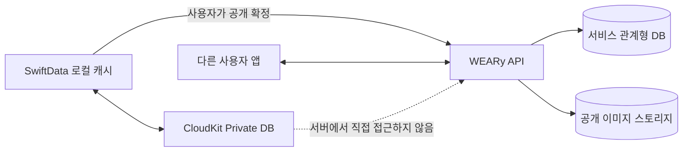
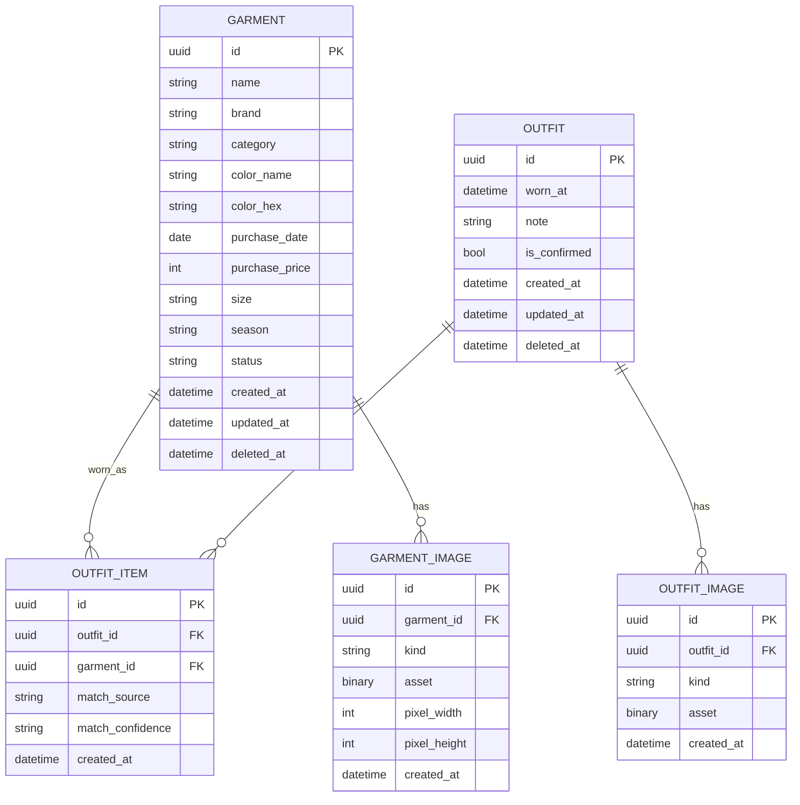
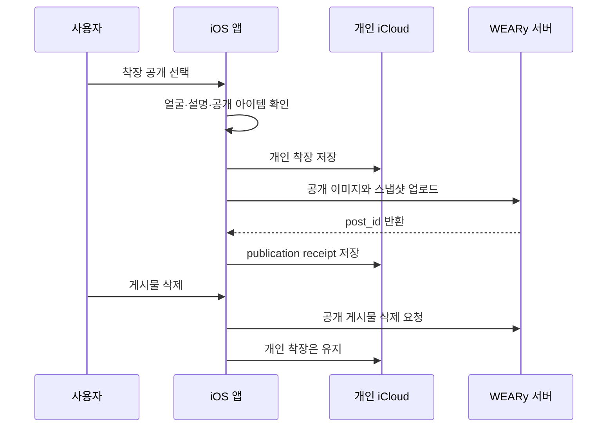

# WEARy 데이터 아키텍처 및 ERD v1

## 1. 설계 목표

WEARy의 데이터는 소유권과 공개 범위에 따라 두 영역으로 분리한다.

| 영역 | 저장 위치 | 데이터 소유권 | 예시 |
| --- | --- | --- | --- |
| 개인 영역 | SwiftData + 사용자의 CloudKit private database | 사용자 | 옷, 구매 가격, 비공개 착장, 착용 통계 |
| 서비스 영역 | WEARy API 서버 + 관계형 DB + 오브젝트 스토리지 | 서비스가 사용자 동의 범위에서 처리 | 공개 게시물, 댓글, 팔로우, 판매 상품, 채팅 |

핵심 원칙은 다음과 같다.

- 서버는 사용자의 개인 CloudKit 데이터베이스를 직접 조회하지 않는다.
- 개인 착장은 기본적으로 비공개다.
- 공개 또는 판매를 확정할 때 앱이 필요한 필드만 서비스 서버로 복사한다.
- 공개 데이터는 원본을 참조하는 포인터가 아니라 당시 정보의 스냅샷이다.
- 게시물이나 판매 글을 삭제해도 개인 옷장과 착장 기록은 유지된다.
- 개인 옷을 삭제해도 이미 공개된 데이터는 별도 삭제 요청 전까지 독립적으로 유지될 수 있음을 게시 전에 안내한다.

## 2. 전체 데이터 흐름



앱 삭제 후 재설치 시 같은 Apple 계정으로 iCloud에 로그인되어 있고 앱의 iCloud 사용이 허용되어 있다면, 개인 영역을 CloudKit에서 다시 동기화하는 경험을 목표로 한다. 동기화가 끝나기 전에는 빈 옷장으로 단정하지 않고 진행 상태를 표시해야 한다.

## 3. 개인 iCloud 영역 ERD

개인 영역은 현재 SwiftData 모델을 발전시킨다. 통계 값은 중복 저장하지 않고 확정된 `OUTFIT_ITEM`을 기준으로 계산한다.



### 개인 모델 규칙

- `GARMENT_IMAGE.kind`: `original`, `cutout_thumbnail`.
- `OUTFIT_IMAGE.kind`: `original`, 추후 `face_hidden_public_preview` 등을 추가할 수 있다.
- 한 착장에는 같은 옷을 한 번만 연결한다. 앱 로직으로 `(outfit_id, garment_id)` 중복을 막는다.
- `wear_count`, `last_worn_at`, `cost_per_wear`는 `OUTFIT_ITEM`과 `OUTFIT`에서 계산한다.
- `is_published`는 개인 데이터의 진실 원천으로 두지 않는다. 서버 게시 결과를 추적하려면 `PUBLICATION_RECEIPT` 같은 로컬 영수증 모델을 별도로 추가한다.
- CloudKit 동기화 모델에서는 UUID를 애플리케이션 수준 식별자로 사용하고, 현재의 `@Attribute(.unique)` 사용 가능 여부를 실제 CloudKit 컨테이너에서 검증한 뒤 스키마를 마이그레이션한다.
- 사진은 원본과 작은 누끼 이미지를 분리한다. 대용량 원본의 업로드 비용, iCloud 용량, 셀룰러 정책을 별도로 검증한다.

### 공개·판매 연결 영수증

개인 영역에는 서버 객체 전체를 복제하지 않고 다음 최소 정보만 저장하는 방식을 권장한다.

| 필드 | 의미 |
| --- | --- |
| `id` | 로컬 영수증 UUID |
| `source_type` | `outfit` 또는 `garment` |
| `source_id` | 개인 영역 객체 UUID |
| `destination_type` | `post` 또는 `listing` |
| `server_id` | 서버가 발급한 공개 객체 ID |
| `published_at` | 업로드 완료 시각 |
| `last_sync_status` | 업로드·수정·삭제 동기화 상태 |

## 4. 서비스 서버 ERD

이 ERD는 특정 서버 프레임워크와 무관한 논리 모델이다. 첫 서버 MVP에는 게시물, 반응, 판매 상품과 최소 채팅만 구현하고 운영 기능은 순차적으로 추가한다.

```mermaid
erDiagram
    USER ||--|| PROFILE : has
    USER ||--o{ POST : authors
    USER ||--o{ COMMENT : writes
    USER ||--o{ POST_LIKE : likes
    USER ||--o{ BOOKMARK : saves
    USER ||--o{ FOLLOW : follows
    USER ||--o{ FOLLOW : is_followed
    POST ||--o{ POST_MEDIA : contains
    POST ||--o{ POST_ITEM : tags
    POST ||--o{ COMMENT : receives
    POST ||--o{ POST_LIKE : receives
    POST ||--o{ BOOKMARK : receives
    USER ||--o{ LISTING : sells
    LISTING ||--o{ LISTING_MEDIA : contains
    LISTING ||--o{ LISTING_FAVORITE : receives
    USER ||--o{ LISTING_FAVORITE : creates
    CONVERSATION ||--o{ CONVERSATION_MEMBER : includes
    USER ||--o{ CONVERSATION_MEMBER : joins
    CONVERSATION ||--o{ MESSAGE : contains
    USER ||--o{ MESSAGE : sends
    LISTING ||--o{ CONVERSATION : concerns
    LISTING ||--o{ PURCHASE_REQUEST : receives
    USER ||--o{ PURCHASE_REQUEST : requests
    USER ||--o{ REPORT : submits
    USER ||--o{ USER_BLOCK : blocks
    USER ||--o{ USER_BLOCK : is_blocked

    USER {
        uuid id PK
        string apple_subject UK
        string status
        datetime created_at
        datetime deleted_at
    }

    PROFILE {
        uuid user_id PK_FK
        string handle UK
        string display_name
        string bio
        string avatar_url
        datetime updated_at
    }

    POST {
        uuid id PK
        uuid author_id FK
        uuid source_private_id
        string caption
        string visibility
        string status
        datetime created_at
        datetime updated_at
        datetime deleted_at
    }

    POST_MEDIA {
        uuid id PK
        uuid post_id FK
        string media_url
        string media_type
        int sort_order
        int width
        int height
    }

    POST_ITEM {
        uuid id PK
        uuid post_id FK
        uuid source_private_id
        string name_snapshot
        string brand_snapshot
        string category_snapshot
        string size_snapshot
        string image_url
        int sort_order
    }

    COMMENT {
        uuid id PK
        uuid post_id FK
        uuid author_id FK
        uuid parent_comment_id FK
        string body
        string status
        datetime created_at
        datetime deleted_at
    }

    POST_LIKE {
        uuid user_id PK_FK
        uuid post_id PK_FK
        datetime created_at
    }

    BOOKMARK {
        uuid user_id PK_FK
        uuid post_id PK_FK
        datetime created_at
    }

    FOLLOW {
        uuid follower_id PK_FK
        uuid following_id PK_FK
        string status
        datetime created_at
    }

    LISTING {
        uuid id PK
        uuid seller_id FK
        uuid source_private_id
        string title
        string description
        int price
        string currency
        int original_price
        string size_snapshot
        string condition
        string status
        bool disclose_wear_count
        int wear_count_snapshot
        datetime created_at
        datetime updated_at
        datetime deleted_at
    }

    LISTING_MEDIA {
        uuid id PK
        uuid listing_id FK
        string media_url
        int sort_order
    }

    LISTING_FAVORITE {
        uuid user_id PK_FK
        uuid listing_id PK_FK
        datetime created_at
    }

    CONVERSATION {
        uuid id PK
        uuid listing_id FK
        datetime created_at
        datetime last_message_at
    }

    CONVERSATION_MEMBER {
        uuid conversation_id PK_FK
        uuid user_id PK_FK
        datetime last_read_at
        datetime left_at
    }

    MESSAGE {
        uuid id PK
        uuid conversation_id FK
        uuid sender_id FK
        string type
        string body
        string media_url
        datetime created_at
        datetime deleted_at
    }

    PURCHASE_REQUEST {
        uuid id PK
        uuid listing_id FK
        uuid buyer_id FK
        string status
        datetime created_at
        datetime updated_at
    }

    REPORT {
        uuid id PK
        uuid reporter_id FK
        string target_type
        uuid target_id
        string reason
        string status
        datetime created_at
    }

    USER_BLOCK {
        uuid blocker_id PK_FK
        uuid blocked_id PK_FK
        datetime created_at
    }
```

### 서버 모델 규칙

- 서버 사용자 식별자는 `Apple로 로그인`의 서버 검증 결과로 생성한다. iCloud 사용 가능 여부와 커뮤니티 로그인 상태는 분리한다.
- `source_private_id`는 앱이 재게시·수정 상태를 찾기 위한 불투명 UUID다. 서버가 이 값으로 CloudKit을 조회할 수는 없다.
- `POST_ITEM`과 `LISTING`은 개인 옷 데이터의 스냅샷을 가진다. 사용자가 개인 옷 이름을 바꾸어도 기존 공개 콘텐츠가 예기치 않게 바뀌지 않는다.
- 좋아요, 저장, 팔로우는 사용자별 조인 테이블을 진실 원천으로 삼는다. 화면용 개수는 캐시할 수 있지만 재계산 가능해야 한다.
- 게시물, 댓글, 메시지와 상품은 신고 처리와 분쟁 대응을 위해 `status`와 soft delete를 사용한다.
- 가격은 부동소수점이 아닌 최소 화폐 단위의 정수로 저장한다.
- 판매 상품 상태 전이는 `draft → active → reserved → sold` 또는 `cancelled`로 제한한다.
- 결제·정산·배송은 첫 서버 MVP ERD에서 제외하고 정책 확정 후 별도 도메인으로 추가한다.

## 5. 개인 데이터가 공개되는 과정



업로드가 실패하면 개인 착장 저장은 성공 상태로 유지하고, 공개 영수증만 `failed` 또는 `pending`으로 둔다. 네트워크 복구 후 사용자가 재시도할 수 있어야 하며 중복 게시를 막기 위해 idempotency key를 사용한다.

## 6. 동기화 및 충돌 정책 초안

| 상황 | 정책 |
| --- | --- |
| 두 기기에서 같은 옷 정보 수정 | 필드 단위 병합이 어렵다면 최신 `updated_at` 우선, 충돌 로그 보존 |
| 한 기기에서 옷 삭제, 다른 기기에서 착장 추가 | 삭제를 즉시 물리 삭제하지 않고 `deleted_at`으로 전파 후 사용자 확인 |
| 공개 업로드 중 앱 종료 | 로컬 영수증 `pending`을 재시도 |
| 게시 요청 재전송 | 동일 idempotency key에는 같은 서버 객체 반환 |
| iCloud 로그아웃 | 로컬 접근 정책과 로그아웃 안내를 별도 정의하고 공개 서버 계정은 자동 로그아웃하지 않음 |
| 서버 게시물 삭제 | 개인 착장에는 영향 없음 |
| 개인 옷 삭제 | 서버 스냅샷에는 자동 영향 없음; 연결된 공개 항목 삭제 선택 제공 |

## 7. 이미지 저장 원칙

| 이미지 | 개인 iCloud | 서비스 스토리지 |
| --- | --- | --- |
| 옷 원본 | 저장 | 판매자가 선택한 경우에만 공개용 사본 |
| 옷 누끼 썸네일 | 저장 | 게시물·상품에 필요할 때 최적화 사본 |
| 전신 착장 원본 | 저장 | 저장하지 않음 |
| 커뮤니티 공개 이미지 | 선택 전 편집본을 개인 영역에 둘 수 있음 | 리사이즈·메타데이터 제거 후 저장 |
| 채팅 이미지 | 저장하지 않음 | 보존 정책이 적용된 서버 객체 |

공개 업로드 전 위치 정보 등 이미지 메타데이터를 제거하고, 얼굴 숨김 여부와 공개할 옷 정보를 사용자가 확인해야 한다.

## 8. 구현 단계

### 단계 A — 개인 iCloud 동기화

1. Apple Developer에서 iCloud와 CloudKit capability를 구성한다.
2. 개발·운영 CloudKit 컨테이너를 구분한다.
3. SwiftData 모델을 CloudKit 호환 스키마로 마이그레이션한다.
4. 메타데이터부터 두 기기 동기화와 재설치 복원을 검증한다.
5. 옷 및 착장 이미지의 업로드 용량과 속도를 측정한다.
6. 동기화 중·실패·iCloud 미로그인 UI를 구현한다.

### 단계 B — 커뮤니티 서버 최소 기능

1. Apple로 로그인과 서버 토큰 검증을 구현한다.
2. 프로필, 게시물, 미디어 업로드 API를 구현한다.
3. 좋아요, 댓글, 저장과 팔로우를 구현한다.
4. 신고, 차단, soft delete와 운영 도구를 함께 구현한다.
5. 페이지네이션, rate limit, 관측성과 백업을 적용한다.

### 단계 C — 패션 중고거래

1. 판매 상품과 이미지 업로드를 구현한다.
2. 상품 단위 1:1 대화와 구매 요청을 구현한다.
3. 예약·판매 완료 상태 전이와 동시성 제어를 구현한다.
4. 거래 방식 확정 후 결제, 배송, 정산 모델을 별도로 설계한다.

## 9. 아직 결정하지 않은 항목

다음 항목은 서버 구현 전에 제품 결정이 필요하다.

1. 커뮤니티 중심축: 코디 탐색 중심인지 팔로우 피드 중심인지
2. 거래 방식: 전국 택배 중심인지 지역 직거래도 포함하는지
3. 초기 서버 범위: 커뮤니티만 먼저 구축할지 마켓까지 함께 구축할지
4. 이미지 정책: 얼굴 기본 블러 여부와 원본 보존 기간
5. 개인 옷 삭제 시 이미 공개한 게시물·상품의 처리 UX
6. 한 사용자가 여러 Apple 계정 또는 플랫폼을 사용하는 경우의 계정 연결 정책

## 10. Apple 구현 참고자료

- [SwiftData로 기기 간 모델 데이터 동기화](https://developer.apple.com/documentation/swiftdata/syncing-model-data-across-a-person-s-devices)
- [CloudKit 컨테이너 구성](https://developer.apple.com/documentation/cloudkit/ckcontainer)
- [CloudKit 개인 데이터베이스](https://developer.apple.com/documentation/cloudkit/ckcontainer/privateclouddatabase)
- [Apple로 로그인](https://developer.apple.com/sign-in-with-apple/)

