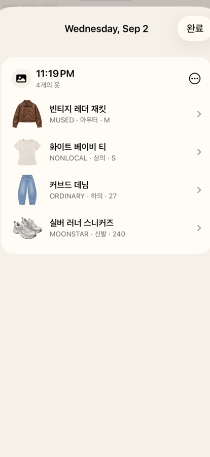
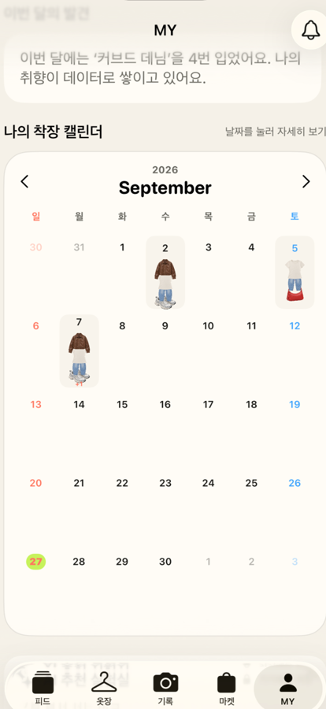
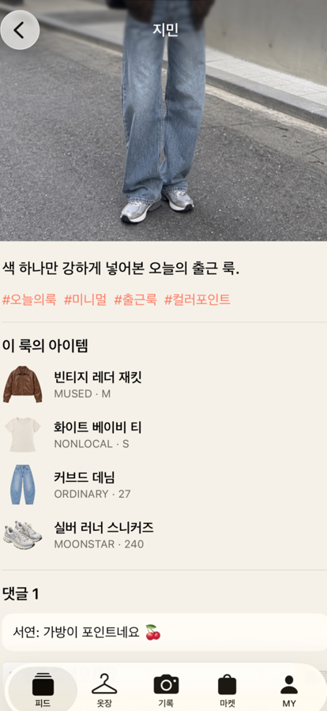
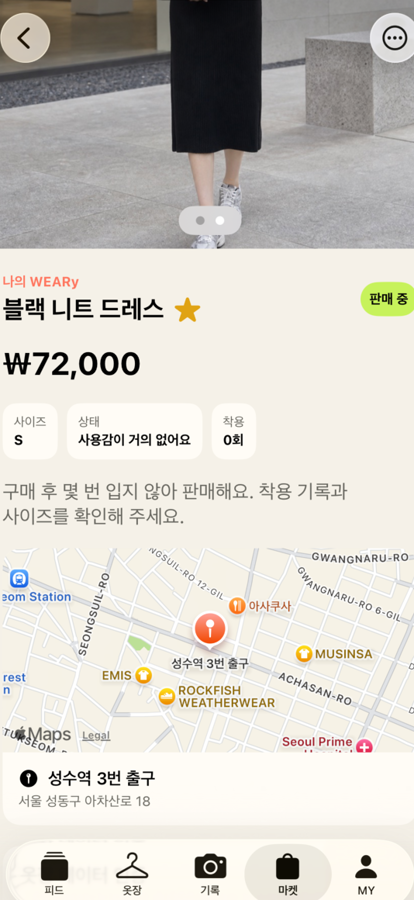
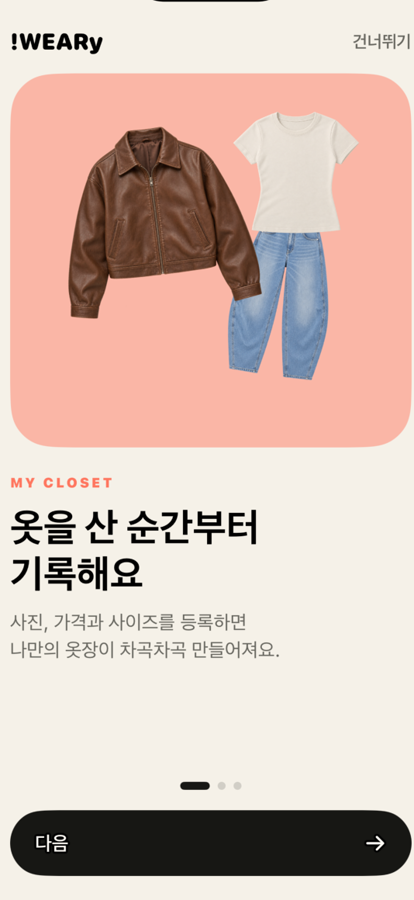
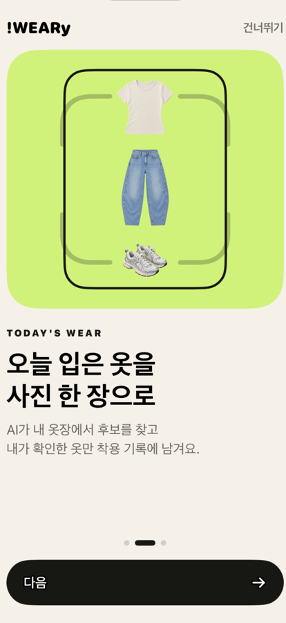
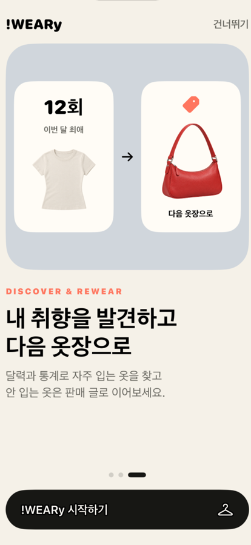
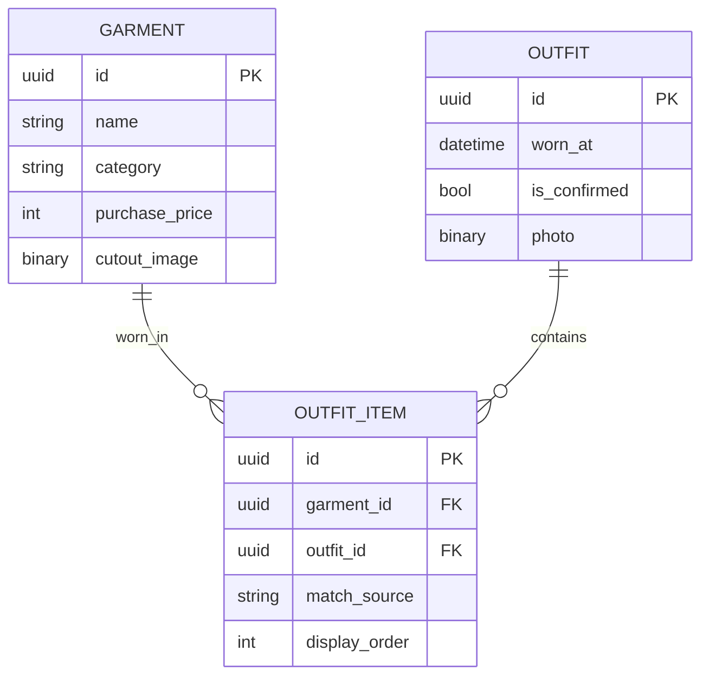
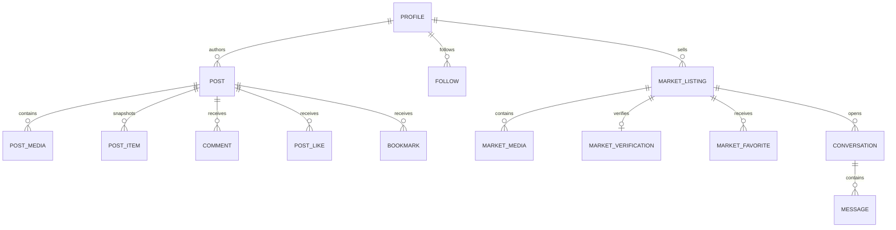

# !WEARy

매일의 착장을 기록하고, 옷의 실제 활용도를 확인하며, 스타일 공유와 중고거래까지 이어가는 iOS 패션 플랫폼 프로토타입입니다.

> Don't WEARy, Be HAPPY.

## 제품 개요

!WEARy는 세 가지 경험을 하나의 흐름으로 연결합니다.

1. **개인 옷장 관리** — 옷 사진과 구매 정보를 등록하고 착용 횟수·1회당 착용 비용을 확인합니다.
2. **패션 커뮤니티** — 실제 착장 사진을 게시하고 아이템 정보, 좋아요, 댓글, 저장과 팔로우를 이용합니다.
3. **패션 중고거래** — 잘 입지 않는 옷을 옷장 데이터와 함께 판매하고 관심·채팅·거래 상태를 관리합니다.

개인 옷장과 비공개 착장은 기기에 저장하고, 사용자가 공개한 게시물·매물·채팅만 Supabase에 저장하는 로컬 우선 구조입니다.

## 앱 화면

### 핵심 사용자 흐름

| 피드 | 개인 옷장 | 착장 기록 |
| :---: | :---: | :---: |
|  |  |  |
| 실제 착장 사진을 발견하고 소통합니다. | 누끼 이미지와 착용 횟수를 관리합니다. | 촬영 후 옷장 후보 추천을 시작합니다. |

### 개인 기록과 프로필

| 날짜별 착장 상세 | 월간 착장 캘린더 | MY |
| :---: | :---: | :---: |
|  |  |  |
| 해당 날짜에 입은 아이템을 확인합니다. | 월간 착장과 반복 착용 패턴을 돌아봅니다. | 프로필·소셜 지표·개인 통계를 확인합니다. |

### 커뮤니티와 중고거래

| OOTD 게시물 상세 | 마켓 | 중고거래 매물 상세 |
| :---: | :---: | :---: |
|  |  |  |
| 착장 사진·태그·연결 아이템·댓글을 함께 보여줍니다. | 옷장에서 이어진 매물을 탐색합니다. | 가격·상태·착용 정보와 만날 장소를 확인합니다. |

### 로그아웃 온보딩

| 나만의 옷장 | 오늘의 착장 기록 | 취향 발견과 순환 |
| :---: | :---: | :---: |
|  |  |  |
| 구매 순간부터 옷 정보를 기록합니다. | 사진 한 장으로 입은 옷을 남깁니다. | 통계로 취향을 찾고 안 입는 옷은 판매합니다. |

로그아웃 상태에서는 세 장의 온보딩을 거쳐 로그인·회원가입으로 연결합니다.

화면은 iPhone 17 Pro 시뮬레이터의 발표용 데모 데이터로 촬영했으며 실제 사용자 정보는 포함하지 않습니다.

## 현재 구현 상태

### 개인 옷장과 착장 기록

- 옷 사진 등록과 Apple Vision 기반 배경 제거
- 브랜드, 카테고리, 사이즈, 구매일, 가격 등 선택 정보 관리
- 착용 횟수와 원 단위 1회당 착용 비용 계산
- 카메라 촬영·사진 보관함 선택과 전후면 카메라 지원
- MY 월간 착장 캘린더와 날짜별 아이템·실제 착장 사진 전환
- 착장 아이템 추가·삭제와 드래그 순서 변경

### 온디바이스 착장 후보 추천

- Apple Vision 특징값 비교와 인체 포즈 정보를 이용한 옷장 후보 추천
- 머리·상체·하체·발·가방 위치를 활용한 보수적 카테고리 선택
- 모자 관련 Vision 분류 단서를 이용한 위치 이탈 보완
- 사용자가 최종 후보를 확정하는 Human-in-the-loop 방식
- 사진과 특징값을 서버로 전송하지 않는 온디바이스 처리
- MY의 추천 실험실에서 처리 시간·캐시·입력 품질 지표 확인

현재 방식은 범용 의류 탐지 모델이 아니라 가벼운 PoC입니다. 실제 정확도는 동의받은 착장 데이터셋으로 별도 검증해야 합니다.

### 커뮤니티

- 실제 착장 사진 중심의 피드 작성과 누끼 아이템 연결
- 커서 페이지네이션, Pull-to-Refresh와 Realtime 갱신
- 좋아요, 댓글, 북마크, 팔로우·팔로워 목록
- 게시물 신고, 사용자 차단과 공개 동의 확인
- 실서버와 발표용 데모 데이터를 섞지 않는 모드 분리

### 중고거래

- 옷장 데이터를 이용한 판매 글 작성과 최대 8장 이미지 업로드
- 선택적 옷장 데이터 인증과 인증 표시
- MapKit 검색·핀 기반 만날 장소 지정
- 가격 변경 이력과 예약·판매 완료 상태
- 관심 등록과 상품별 1:1 Realtime 채팅
- 신고·차단·정책 제재 이후 읽기 전용 대화 보존

### 계정과 운영

- 이메일 회원가입과 이메일·아이디 로그인
- 이메일·아이디·닉네임 중복 검사와 비밀번호 재설정
- HTTPS Universal Link 기반 인증 복귀
- Google·Kakao·Apple OAuth 진입 UI
- 신고 심사, 콘텐츠 숨김, 경고·기간 제한·정지와 이의 제기
- 계정·Storage·기기 데이터 탈퇴 삭제 흐름
- PostgreSQL RLS·RPC·Trigger 기반 서버 권한 집행

## 기술 구성

| 영역 | 기술 |
| --- | --- |
| iOS | SwiftUI, SwiftData, AVFoundation, Vision, MapKit |
| 인증·백엔드 | Supabase Auth, PostgreSQL, Storage, Realtime, Edge Functions |
| 권한 | Row Level Security, RPC, DB Trigger |
| 프로젝트 생성 | XcodeGen |
| 테스트 | Swift Testing, XCTest, Supabase 실서버 통합 테스트 |

```text
┌──────────────────── iPhone ────────────────────┐
│ 개인 SwiftData                                 │
│ 옷 · 구매 정보 · 비공개 착장 · 착용 통계       │
│                                                │
│ 서비스 캐시                                    │
│ 피드 · 마켓의 재생성 가능한 로컬 캐시           │
└──────────────────────┬─────────────────────────┘
                       │ 공개 확정 데이터만 전송
┌──────────────────────▼─────────────────────────┐
│ Supabase                                        │
│ Auth · PostgreSQL · Storage · Realtime           │
│ 프로필 · 게시물 · 관계 · 매물 · 채팅 · 운영 기록│
└─────────────────────────────────────────────────┘
```

## 데이터 모델 요약 ERD

개인 옷장과 비공개 착장은 iPhone의 SwiftData에 남고, 사용자가 공개를 확정한 스냅샷만 Supabase로 전송됩니다.

### iPhone 개인 영역



### Supabase 공개 서비스 영역



로컬 객체와 공개 객체 사이는 데이터베이스 외래 키가 아니라 게시 시점의 `source_private_id`와 옷 정보 스냅샷으로 연결합니다. 전체 컬럼, 운영·신고·제재 관계는 [데이터 아키텍처 및 상세 ERD](./DATA_ARCHITECTURE.md)에서 확인할 수 있습니다.

## 로컬 실행

요구 사항:

- macOS와 Xcode 27 이상
- iOS 18 이상
- XcodeGen
- Supabase 프로젝트 URL과 publishable key

로컬 설정 파일을 준비합니다.

```bash
cp Config/Supabase.local.xcconfig.example Config/Supabase.local.xcconfig
```

`Config/Supabase.local.xcconfig`에 프로젝트 URL과 `sb_publishable_...` 키를 입력한 뒤 프로젝트를 생성합니다.

```bash
xcodegen generate
open WEARy.xcodeproj
```

로컬 설정 파일은 Git에서 제외됩니다. 앱에 Supabase secret/service-role 키나 OAuth provider secret을 포함하지 마세요.

## 인증·보안 설정

- Auth Redirect URL: `https://77romin.github.io/weary/auth/callback`
- 운영 익명 가입 비활성화
- 비밀번호 8자 이상, 영문과 숫자 포함
- `account-auth` 요청 크기·입력 검증과 IP·식별자별 DB 레이트리밋
- 균일한 로그인 실패 응답과 최소 응답 시간
- 레거시 Supabase JWT API 키 비활성화
- 앱은 publishable key, Edge Function은 secret key만 사용

보안 문제를 발견했다면 공개 Issue에 비밀값을 남기지 말고 [SECURITY.md](./SECURITY.md)의 절차를 따라 주세요.

## 검증

- generic iOS Debug `build-for-testing` 성공
- 로컬 단위·UI 테스트와 실제 iPhone 설치·실행 검증
- 독립 사용자 기반 Supabase 게시·반응·팔로우·매물·채팅·신고·차단 통합 검증
- Storage UUID 경로와 RLS 회귀 테스트
- 레거시 API 키 거부 및 새 publishable/secret 키 경로 검증

정확한 최신 범위와 제약은 [FINAL_BUILD_REPORT.md](./FINAL_BUILD_REPORT.md)를 기준으로 합니다.

## 남은 주요 작업

- 실제 착장 데이터셋으로 Vision 후보 품질 측정
- 실제 운영 관리자 계정 확정과 권한 부여
- Google·Kakao·Apple OAuth 운영 키 발급 및 검수
- 유료 Apple Developer 팀 연결 후 CloudKit 다기기·재설치 복원 검증
- Apple Associated Domains CDN의 AASA 수집 확인
- 친구 사용자 테스트와 개인정보·거래 분쟁 정책 검토

## 문서

- [제품 정의](./PRODUCT_CONCEPT.md)
- [포트폴리오 정리](./PORTFOLIO.md)
- [데이터 경계와 ERD](./DATA_ARCHITECTURE.md)
- [콘텐츠 안전 정책](./CONTENT_SAFETY_POLICY.md)
- [개인정보와 계정 탈퇴](./PRIVACY_DATA_DELETION.md)
- [발표 시나리오](./DEMO_GUIDE.md)
- [최종 빌드·검증 보고서](./FINAL_BUILD_REPORT.md)

## 프로젝트 상태

핵심 사용자 흐름과 Supabase 연결을 구현한 기능형 프로토타입입니다. 실제 의류 탐지 모델, CloudKit 운영 연결, OAuth 공급자 운영 승인과 정식 서비스 정책은 후속 단계입니다.
